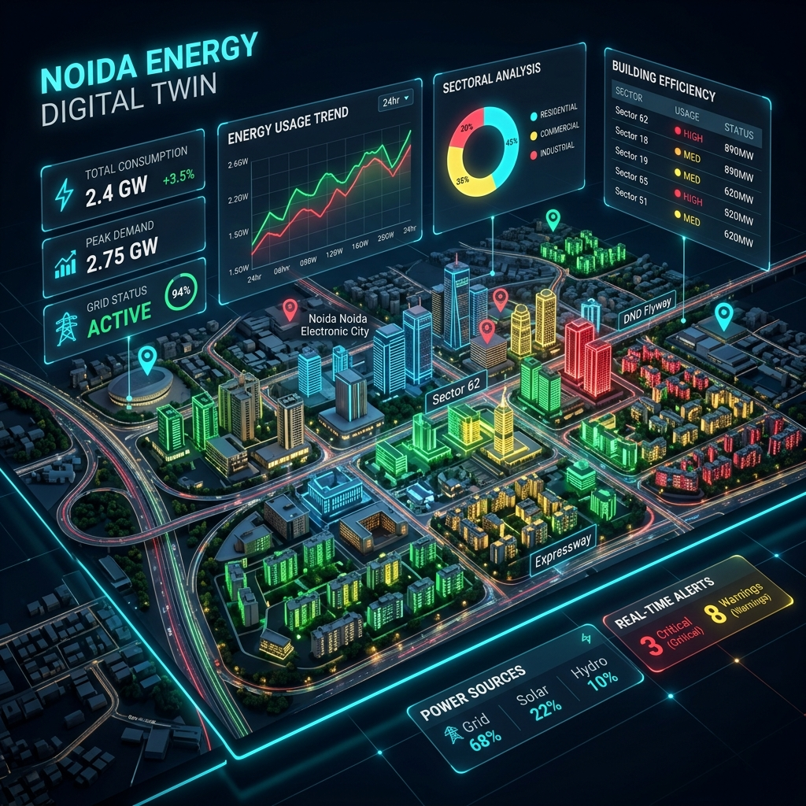

# 🏙️ Noida Energy Digital Twin & Analytics



[](https://opensource.org/licenses/MIT)
[](https://fastapi.tiangolo.com/)
[](https://reactjs.org/)
[](https://www.mapbox.com/)

> **A high-fidelity 3D Digital Twin and predictive analytics platform for urban energy consumption management in Noida, India.**

---

## 🌟 Overview

This project provides a comprehensive suite of tools for visualizing, analyzing, and forecasting energy consumption patterns across Noida. By combining **3D geospatial visualization** with **Machine Learning models**, it enables urban planners and residents to make data-driven decisions about energy usage and solar adoption.

## 🚀 Key Features

### 1. 🗺️ 3D Digital Twin (Interactive Dashboard)
- **Geospatial Heatmaps**: Visualize building-level energy consumption using a Green-Yellow-Red gradient.
- **Sector-wise Analysis**: Interactive filtering by sector, building type, and consumption range.
- **Real-world Data**: Integrated with OSM road networks and normalized building geometries.
- **High Performance**: Built with Mapbox GL JS for fluid 3D navigation.

### 2. 🧠 Predictive Analytics
- **Multi-Model Forecasting**: Includes ARIMA, SARIMA, LSTM, Linear Regression, and XGBoost.
- **Scenario Simulation**: "What-If" modeling for appliance upgrades, behavioral changes, and solar expansion.
- **Feature Importance**: Deep dive into factors like room count, seasonality, and household size.

### 3. ☀️ Solar ROI & Sustainability
- **ROI Calculator**: Interactive tool to estimate payback periods and 20-year savings.
- **Carbon Footprint Tracking**: (In Development) Estimating CO2 reduction through solar transition.

### 4. 💰 UPPCL Bill Estimator
- **Real-time Calculations**: Slab-wise bill estimation based on current Noida electricity tariffs.

---

## 🛠️ Technology Stack

| Layer | Technologies |
| :--- | :--- |
| **Frontend** | React, Vite, Tailwind CSS, Mapbox GL JS, Framer Motion |
| **Backend** | FastAPI, Python 3.9+, Uvicorn |
| **Data Science** | Scikit-Learn, Pandas, NumPy, XGBoost, TensorFlow/Keras (LSTM) |
| **Legacy UI** | Streamlit (for rapid prototyping and deep analytics) |
| **Data Formats** | GeoJSON, Excel (Commercial/Household datasets) |

---

## 📂 Project Structure

```text
.
├── noida-energy-dashboard/    # Main Web Application
│   ├── frontend/              # React + Vite + Mapbox UI
│   └── backend/               # FastAPI + ML Models
├── src/                       # Core data processing & shared utilities
├── assets/                    # Project visuals and media
├── energy_consumption_app.py  # Standalone Streamlit Analytics App
└── requirements.txt           # Legacy python dependencies
```

---

## ⚡ Quick Start

### 1. Modern Web Dashboard (Recommended)

#### Backend Setup
```bash
cd noida-energy-dashboard/backend
pip install -r requirements.txt
python main.py
```

#### Frontend Setup
```bash
cd noida-energy-dashboard/frontend
npm install
npm run dev
```

### 2. Standalone Streamlit Analytics
```bash
pip install -r requirements.txt
streamlit run energy_consumption_app.py
```

---

## 📈 Future Roadmap
- [ ] Integration of real-time smart meter data.
- [ ] AI-driven personalized energy-saving recommendations.
- [ ] Expanded 3D coverage for Greater Noida and neighboring regions.
- [ ] Mobile application for residential consumption tracking.

---

## 🤝 Contributing

Contributions are welcome! Please feel free to submit a Pull Request.

---

## 📄 License

This project is licensed under the MIT License - see the [LICENSE](LICENSE) file for details.

---
*Developed with ❤️ for a sustainable Noida.*
