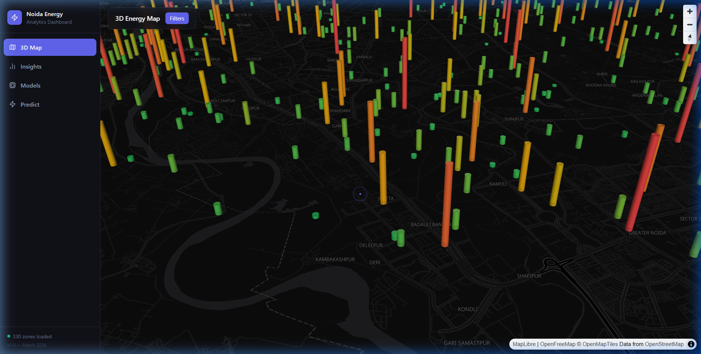

# ⚡ Noida Energy Analytics Dashboard

[](https://fastapi.tiangolo.com/)
[](https://reactjs.org/)
[](https://deck.gl/)
[](https://tailwindcss.com/)

A high-performance, 3D geospatial digital twin for energy consumption analytics in the Noida and Greater Noida region. This platform integrates machine learning predictions with interactive geospatial visualizations to provide actionable insights into urban energy patterns.



## 🌟 Key Features

- **3D Geospatial Visualization:** Real-time rendering of energy consumption across 330+ zones using `deck.gl` and `Mapbox`.
- **Predictive Analytics:** ML-driven electricity demand forecasting using XGBoost and Scikit-learn.
- **Interactive Digital Twin:** Clickable 3D building/zone extrusions with detailed consumption metrics and historical trends.
- **Dynamic Filtering:** Real-time UI controls to filter data by sector, usage type, and time period.
- **Premium UX:** Deep-dark theme with fluid `framer-motion` animations, responsive sidebars, and custom tooltip interactions.

## 🛠️ Technology Stack

### Frontend
- **React 19 & TypeScript:** Type-safe component architecture.
- **Vite:** Next-generation frontend tooling.
- **Deck.gl & MapLibre:** High-performance WebGL-based geospatial visualization.
- **Framer Motion:** Smooth UI transitions and micro-interactions.
- **Recharts:** Interactive data visualization for trends and metrics.

### Backend
- **FastAPI:** High-performance Python web framework.
- **XGBoost & Scikit-learn:** Advanced machine learning models for energy prediction.
- **Uvicorn:** ASGI server for production-grade reliability.
- **Pandas/NumPy:** Robust data processing and manipulation.

## 🚀 Getting Started

### Prerequisites
- **Python 3.11+**
- **Node.js 18+**
- **Mapbox Access Token** (Get one at [mapbox.com](https://mapbox.com))

### Installation & Setup

1. **Clone the repository:**
   ```bash
   git clone https://github.com/prakash14789/resarchnew.git
   cd noida-energy-dashboard
   ```

2. **Backend Setup:**
   ```bash
   cd backend
   pip install -r requirements.txt
   python data/seed_data.py          # Generate synthetic energy data
   python -m uvicorn main:app --reload --port 8000
   ```

3. **Frontend Setup:**
   ```bash
   cd ../frontend
   npm install
   ```

4. **Environment Configuration:**
   Create a `.env` file in the `frontend/` directory:
   ```env
   VITE_MAPBOX_TOKEN=pk.your_mapbox_token_here
   VITE_API_BASE=http://localhost:8000
   ```

5. **Run the Application:**
   ```bash
   npm run dev
   ```
   Visit `http://localhost:5173` to view the dashboard.

## 📊 Project Structure

```text
noida-energy-dashboard/
├── backend/                # FastAPI Application
│   ├── data/               # Seed data and JSON storage
│   ├── ml/                 # ML Models, Trainers, and Predictors
│   ├── routers/            # API Endpoints (Map, Predictions, Models)
│   └── main.py             # App Entry Point
├── frontend/               # Vite + React Application
│   ├── src/
│   │   ├── components/     # UI Components (3D Map, Sidebar, Panels)
│   │   ├── pages/          # Dashboard Pages (Map, Insights, Predict)
│   │   ├── hooks/          # Custom React Hooks
│   │   └── lib/            # API Clients and Utilities
│   └── tailwind.config.ts  # Design System Configuration
└── assets/                 # Project documentation assets
```

## 📜 License
This project is for research and analytical purposes.

---
*Built with ❤️ for Urban Energy Sustainability.*
